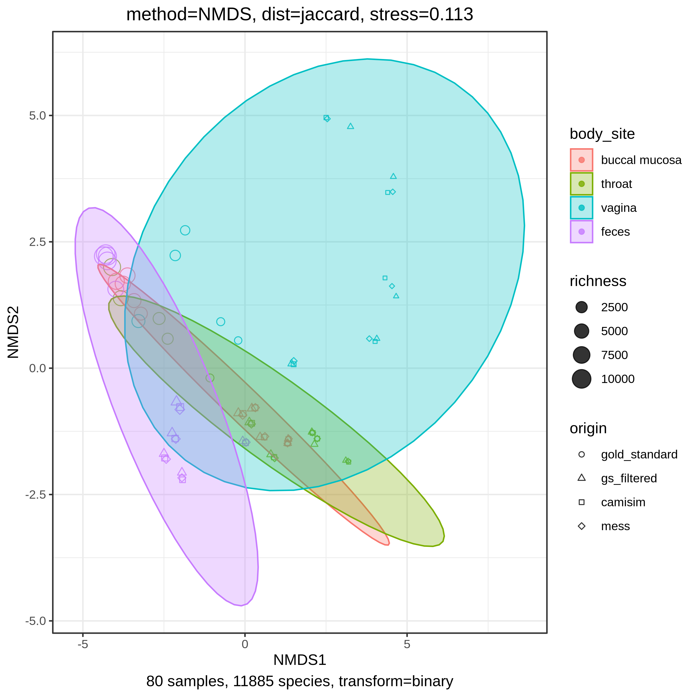
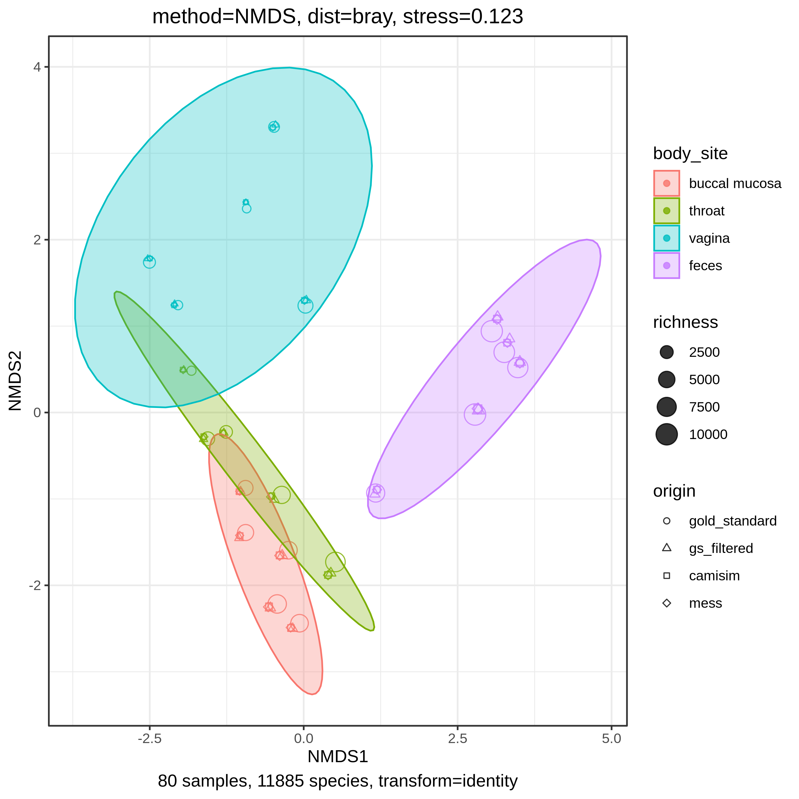
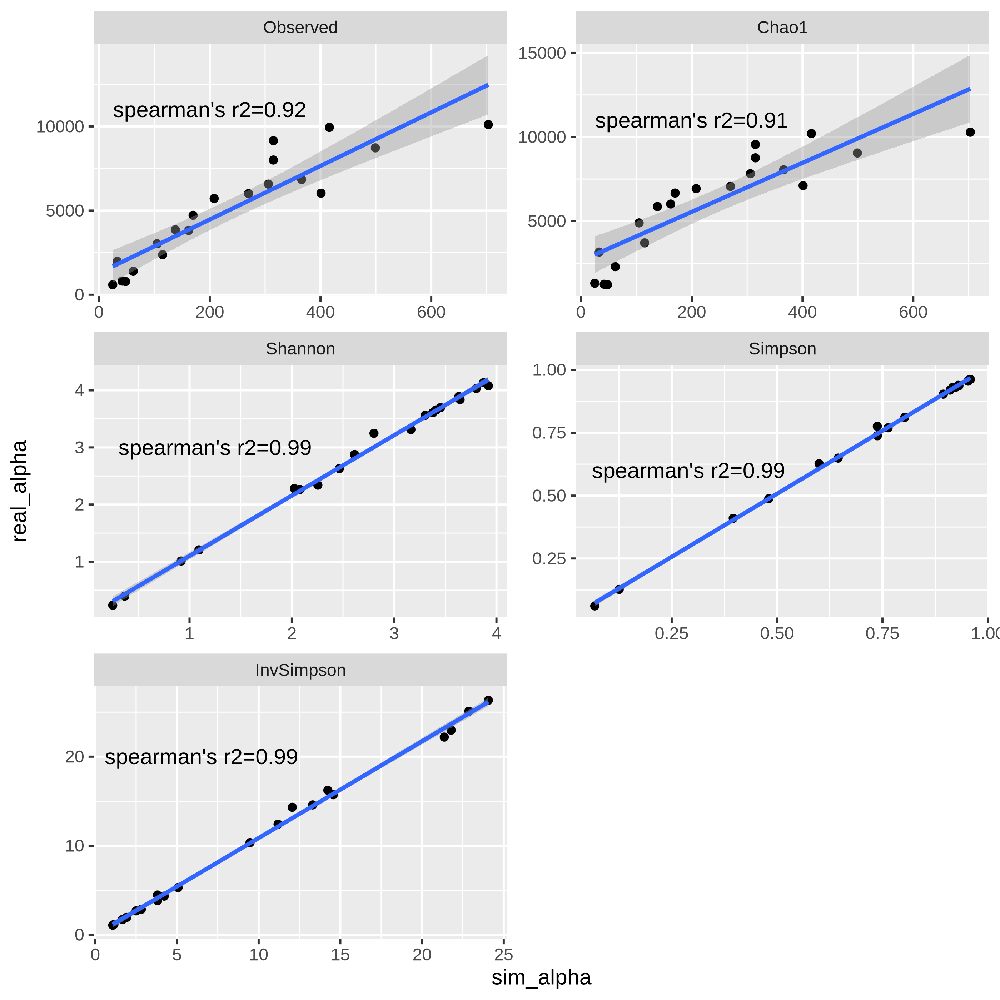
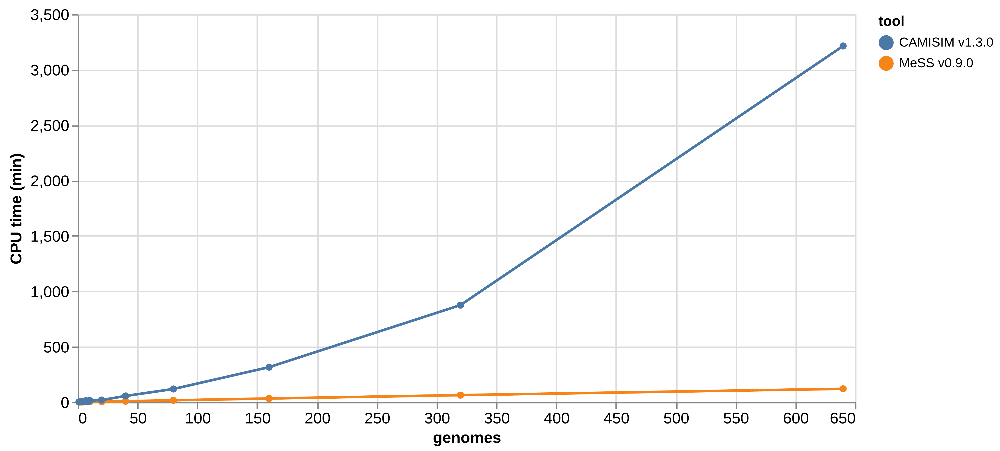
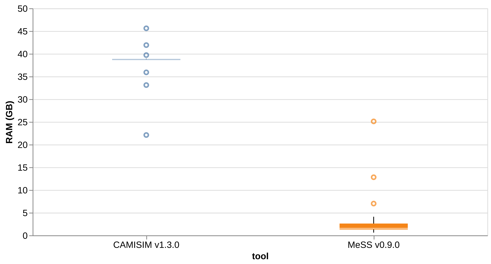

# MeSS figures


[](https://doi.org/10.5281/zenodo.14499940)


This repo contains supplementary code and figures for our paper describing [MeSS](https://github.com/metagenlab/MeSS).

Steps to reproduce the paper's figures are in the following jupyter notebooks:

* [`1_download_and_classify.ipynb`](1_download_and_classify.ipynb) : Download HMP reads and classify them with Kraken2 and Bracken.
* [`2_simulate_reads.ipynb`](2_simulate_reads.ipynb) : Simulate CAMISIM and MeSS reads from the previously obtained Bracken abundances.
* [`3_plot_diversities.ipynb`](3_plot_diversities.ipynb): Plot alpha and beta diversities for simulated and real abundances.
* [`4_plot_resource_usage.ipynb`](4_plot_resource_usage.ipynb): Plot RAM and CPU usage for CAMISIM and MeSS.


## Dependencies

### Install conda

You need a conda ([Miniforge](https://github.com/conda-forge/miniforge)) install to run the notebooks:

```sh
curl -L -O "https://github.com/conda-forge/miniforge/releases/latest/download/Miniforge3-$(uname)-$(uname -m).sh"
bash Miniforge3-$(uname)-$(uname -m).sh
```

### Create conda env

```sh
mamba env create -n notebooks -f env.yaml
```

## Run jupyter lab

```sh
mamba activate notebooks
jupyter lab
```

## Figures

### Diversities

#### Figure 1A
<p align="center">

</p>

#### Figure 1B
<p align="center">

</p>

#### Figure S1
<p align="center">

</p>

### Benchmark

#### Figure S2
<p align="center">

</p>

#### Figure S3
<p align="center">

</p>